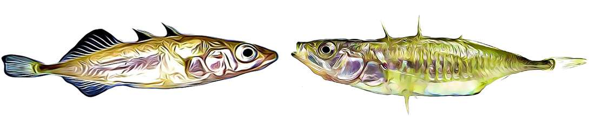

# Bioinformatics. Evolution. Environment. Genomics.

## [ site under construction ...]

in the meantime, please visit the **[updated lab website](https://fredericchain.weebly.com)**

###  we use bioinformatics to study evolutionary and environmental genomics

