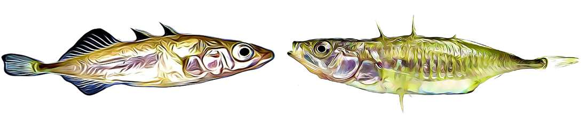

# Bioinformatics. Evolution. Environment. Genomics.

### [ site under construction ...]


in the meantime, please visit the updated website https://fredericchain.weebly.com


###  we use bioinformatics to study evolutionary and environmental genomics



```markdown

genome evolution during adaptation and speciation

```

```markdown
duplicate genes and copy number variations (CNVs)

```

```markdown
mutational spectra and microbiome diversity under stress

```

```markdown
environmental biomonitoring using eDNA

```

